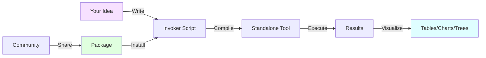
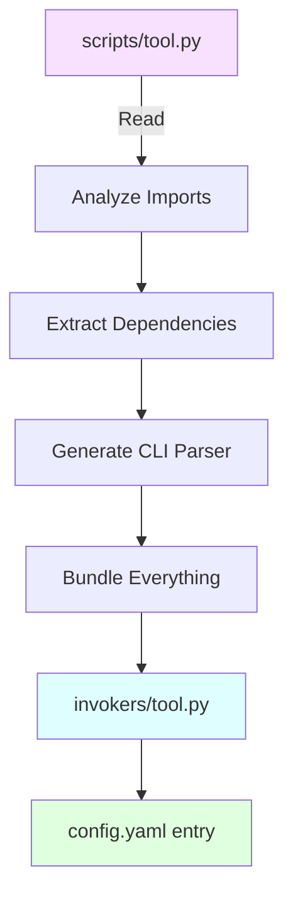
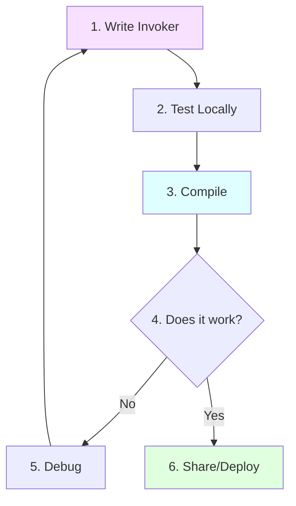

# 🧠 Core Concepts

Understanding these fundamental concepts will make everything else click into place.

## 🎯 The Big Picture



Sierra SDK has **three main workflows**:

1. **Create** - Build your own investigation tools
2. **Use** - Install and run community tools  
3. **Share** - Package and distribute your tools

Let's understand each component!

---

## 📦 What is an Invoker?

!!! quote "Simple Definition"
    An **invoker** is a specialized Python script that performs a specific task and returns formatted results.

### Think of It Like This

- **Regular Python Script**: Prints text to console, hard to reuse
- **Sierra Invoker**: Structured tool with inputs, validation, and formatted output

### Anatomy of an Invoker

```python
import sierra

# 1. DEFINE: What is this tool?
invoker = sierra.InvokerScript(
    name="my_tool",
    description="What this tool does"
)

# 2. DEPENDENCIES: Helper functions (optional)
@invoker.dependancy
def helper_function():
    # Do some work
    return result

# 3. ENTRY POINT: Main logic
@invoker.entry_point
def run(
    target: sierra.Param[str, sierra.SierraOption(mandatory="MANDATORY")]
):
    # Your investigation logic here
    data = helper_function()
    
    # Return formatted results
    result = sierra.Table(headers=["Column"], rows=[[data]])
    sierra.respond(result)

# 4. LOADER: Register with Sierra
def load(client):
    client.load_invoker(invoker)
```

**Breaking it down:**

1. **Define** - Give your tool a name and description
2. **Dependencies** - Optional helper functions marked with `@invoker.dependancy`
3. **Entry Point** - Main function marked with `@invoker.entry_point`
4. **Loader** - Hook to register your invoker

!!! tip "The Power of Structure"
    This structure allows Sierra to:
    
    - ✅ Validate your inputs automatically
    - ✅ Generate command-line interfaces
    - ✅ Create standalone scripts
    - ✅ Ensure type safety

---

## 🏗️ Environments

An **environment** is a workspace where you develop and organize your invokers.

### Directory Structure

```
default_env/                 # Your environment
├── scripts/                 # Source invoker files (you write these)
│   ├── tool1.py
│   └── tool2.py
├── invokers/                # Compiled standalone scripts (auto-generated)
│   ├── tool1.py
│   └── tool2.py
├── venv/                    # Python virtual environment
├── config.yaml              # Auto-generated configuration
└── source                   # Package source metadata
```

### Why Environments?

- **Organization** - Keep different projects separate
- **Isolation** - Each environment has its own dependencies
- **Portability** - Share the entire environment

Creating an environment:

```bash
sierra-dev init my_project
```

---

## ⚙️ The Compilation Process

!!! info "What is Compilation?"
    Converting your source invoker into a **standalone script** that can run independently.

### Why Compile?

Your source invoker imports `sierra` and uses its features. But the compiled script:

- ✅ Runs without Sierra SDK installed
- ✅ Has all dependencies bundled
- ✅ Includes command-line argument parsing
- ✅ Can be shared as a single file

### What Happens During Compilation?



**Step by step:**

1. **Read** - Sierra reads your source script
2. **Analyze** - Identifies imports and dependencies
3. **Transform** - Removes Sierra-specific code
4. **Generate** - Creates standalone version with CLI
5. **Bundle** - Packages everything needed
6. **Output** - Writes compiled script and YAML config

### Running Compilation

```bash
sierra-dev build --env my_project
```

---

## 📊 Result Types

Sierra provides structured result types for beautiful data visualization.

### Available Types

| Type | Use Case | Example |
|------|----------|---------|
| **Table** | Tabular data | Scan results, lists |
| **Tree** | Hierarchical data | Directory structures, categories |
| **Timeline** | Time-based events | Historical data, logs |
| **Chart** | Statistical data | Distributions, comparisons |
| **Network** | Relationships | Social graphs, connections |

### Example: Table Result

```python
result = sierra.Table(
    headers=["Name", "Status", "Score"],
    rows=[
        ["Test 1", "Pass", "95"],
        ["Test 2", "Pass", "87"],
        ["Test 3", "Fail", "42"]
    ]
)
sierra.respond(result)
```

Output (JSON):
```json
{
  "type": "Table",
  "headers": ["Name", "Status", "Score"],
  "rows": [...]
}
```

!!! tip "Why Structured Results?"
    - **Consistency** - Same format every time
    - **Integration** - Easy to parse and use
    - **Visualization** - Sierra platform renders beautifully
    - **Machine-Readable** - Perfect for automation

---

## 📦 Packages

A **package** is a published invoker that others can install and use.

### Package Ecosystem


### Package Manager Commands

```bash
# Add a repository of packages
sierra-dev repo add https://github.com/xsyncio/sierra-invokers

# Search for packages
sierra-dev search domain

# Install a package
sierra-dev install whois-lookup

# Build to compile the installed package
sierra-dev build
```

### How It Works

1. **Repositories** - GitHub repos hosting invokers
2. **Registry** - Index of available packages
3. **Installation** - Downloads to your environment
4. **Compilation** - Builds into usable tools

---

## 🔐 Type Safety & Validation

Sierra uses Python's type hints for automatic validation.

### Without Type Safety

```python
def scan(target):  # What type? What if None?
    # Hope the user provides valid input!
    ...
```

### With Type Safety

```python
@invoker.entry_point
def run(
    target: sierra.Param[
        str | None,  # Type annotation
        sierra.SierraOption(mandatory="MANDATORY")  # Validation rule
    ]
):
    if target is None:  # Won't happen - Sierra validates!
        return sierra.create_error_result("Missing target")
    # target is guaranteed to be a string
```

**Benefits:**

- ✅ **Catch errors early** - Before script runs
- ✅ **Auto-generate help** - CLI knows parameter types
- ✅ **Better IDE support** - Autocomplete works
- ✅ **Self-documenting** - Code explains itself

---

## 🎭 Parameters vs Options

Understanding the difference:

### Parameter
What your invoker needs as input:

```python
target: sierra.Param[str, ...]  # "target" is a parameter
```

### Option
Rules and metadata about that parameter:

```python
sierra.SierraOption(
    description="Website URL to analyze",
    mandatory="MANDATORY"  # This is an option
)
```

**Think of it as:**
- **Parameter** = The data
- **Option** = How to validate/describe that data

---

## 🔄 The Development Workflow

Typical workflow when creating an invoker:



### Detailed Steps

**1. Write Invoker** (`scripts/my_tool.py`)
```python
import sierra
invoker = sierra.InvokerScript(name="my_tool", ...)
# ... rest of code
```

**2. Test Locally**
```bash
# Create environment if needed
sierra-dev init test_env

# Place script in scripts/
cp my_tool.py test_env/scripts/
```

**3. Compile**
```bash
sierra-dev build --env test_env
```

**4. Test Compiled Version**
```bash
test_env/venv/bin/python test_env/invokers/my_tool.py --help
```

**5. Debug if Needed**
- Check validation errors
- Use `--verbose` flag
- Review logs

**6. Share**
- Push to GitHub
- Add to package registry
- Others can install!

---

## 🎓 Key Takeaways

!!! success "Concepts You Now Understand"
    - ✅ **Invoker** - A structured investigation tool
    - ✅ **Environment** - A workspace for your invokers
    - ✅ **Compilation** - Making standalone scripts
    - ✅ **Result Types** - Formatted, structured output
    - ✅ **Packages** - Shareable, installable tools
    - ✅ **Type Safety** - Automatic validation
    - ✅ **Workflow** - Write → Compile → Test → Share

## 🚀 Ready to Build?

Now that you understand the concepts, let's create your first invoker!

[→ Your First Invoker Tutorial](quickstart.md){ .md-button .md-button--primary }
[→ CLI Command Reference](cli-reference.md){ .md-button }

---

## 🤔 Still Have Questions?

Common questions beginners ask:

??? question "Do I need to know Python well?"
    Basic Python knowledge helps, but you can learn as you go! Our tutorials start with simple examples and gradually introduce more concepts.

??? question "Can I use external libraries (requests, beautifulsoup, etc.)?"
    Yes! Use `invoker.requirement([\"requests\"])` to specify dependencies. Sierra handles installation during compilation.

??? question "What's the difference between source and compiled?"
    * **Source** (`scripts/`) - Your editable code with Sierra imports
    * **Compiled** (`invokers/`) - Standalone version that runs anywhere

??? question "How do I debug my invoker?"
    Use `sierra-dev build --env myenv --verbose` for detailed logs. Check validation errors before compilation.

??? question "Can compiled invokers run on other machines?"
    Yes, but they need Python and the dependencies installed. The environment's `venv/` contains everything needed.
