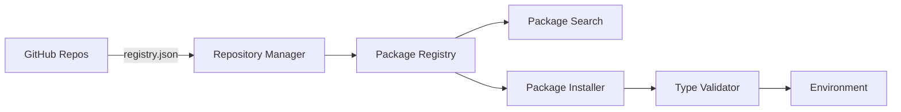

# Package Manager Overview

Sierra Dev's package manager provides **APT-like functionality** for installing, managing, and updating invoker scripts from GitHub repositories. It is designed to be robust, type-safe, and easy to use.

## Architecture

The package manager consists of several modular components working together:



## Core Components

### 1. Repository Manager
Manages GitHub repository sources for package discovery. It handles:
- Adding/removing repository sources
- Fetching and caching package registries
- Managing source priorities
- Validating repository structure

```python
from sierra.package_manager import RepositoryManager

repo_mgr = RepositoryManager(config_dir)
repo_mgr.add_source("https://github.com/xsyncio/sierra-invokers")
```

### 2. Package Registry
The central registry for package metadata and search. It provides:
- Fast search by name, description, or tags
- Filtering by category and source
- Version tracking and comparison
- Metadata aggregation

```python
from sierra.package_manager import PackageRegistry

registry = PackageRegistry(repo_mgr)
registry.refresh()
packages = registry.search("osint", tag="email")
```

### 3. Package Installer
Handles the lifecycle of packages on the local system:
- Downloading scripts from GitHub
- Resolving dependencies
- Running type safety checks
- Managing the installed packages manifest

```python
from sierra.package_manager import PackageInstaller

installer = PackageInstaller(repo_mgr, env_path)
installer.install("digital-footprint", registry)
```

### 4. Type Validator
Ensures that all installed scripts meet Sierra Dev's strict quality standards:
- **AST-based analysis**: Checks code without executing it
- **Type annotations**: Verifies arguments and return types
- **Safety checks**: Detects unsafe patterns

```python
from sierra.package_manager import validate_invoker_script

is_valid, report = validate_invoker_script(script_path)
```

## Repository Structure

A Sierra Dev repository on GitHub follows a strict structure to ensure compatibility:

```
sierra-invokers/
├── registry.json          # Master package index
├── invokers/              # Package directories
│   ├── digital-footprint/
│   │   ├── invoker.py    # The script itself
│   │   ├── metadata.json # Detailed metadata
│   │   └── README.md     # Documentation
│   └── crt-sh/
│       ├── invoker.py
│       └── metadata.json
```

### registry.json Example

```json
{
  "version": "1.0.0",
  "updated": "2024-11-26T10:00:00Z",
  "packages": {
    "digital-footprint": {
      "name": "digital-footprint",
      "version": "1.2.0",
      "description": "OSINT digital footprint analyzer",
      "author": "xsyncio",
      "tags": ["osint", "email", "breach"],
      "category": "reconnaissance",
      "path": "invokers/digital-footprint"
    }
  }
}
```

## Local Storage

Sierra Dev maintains its state in the user's home directory (`~/.sierra/`):

- **`sources.json`**: List of configured repositories and their priorities.
- **`installed.json`**: Manifest of all installed packages and their versions.
- **`cache/`**: Local cache of registries and downloaded files to speed up operations.

## Key Features

### 🔄 Auto-Updates
Sierra Dev can check for updates across all installed packages and upgrade them with a single command:

```bash
sierra-dev update --all
```

### 🛡️ Type Safety
Every script is validated before installation. If a script lacks type hints or uses unsafe patterns, Sierra Dev will warn you or refuse installation (unless `--force` is used).

### 🔍 Smart Search
Search is fuzzy and context-aware. You can search by:
- **Keyword**: `sierra-dev search osint`
- **Tag**: `sierra-dev search --tag email`
- **Category**: `sierra-dev search --category recon`

### 📦 Dependency Management
Packages can declare dependencies (e.g., Python libraries). Sierra Dev will notify you of required dependencies upon installation.

## Next Steps

- [CLI Commands Reference](commands.md) - Master the 14 CLI commands
- [Creating Invokers](../development.md) - Learn to build your own packages
- [API Reference](../sierra/client.md) - Integrate Sierra Dev into your Python tools
