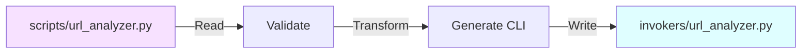

# 🚀 Your First 5 Minutes with Sierra SDK

Build your first investigation tool from scratch in 5 minutes!

!!! success "What You'll Learn"
    - Create a working invoker
    - Compile it to a standalone tool
    - Run it and see formatted results
    - Understand the complete workflow

---

## 🎯 The Goal

We're building `url_analyzer` - a simple tool that:

1. Takes a URL as input
2. Extracts basic information
3. Displays results in a table

---

## Step 1: Create Environment (30 seconds)

!!! tip "Make sure Sierra SDK is installed first!"
    If you haven't installed it yet, see the [Installation Guide](installation.md).

Open your terminal and run:

```bash
sierra-sdk init my_first_project
cd my_first_project
```

✅ **You now have:**
```
my_first_project/
├── scripts/       # Your code goes here
├── config.yaml    
└── source
```

---

## Step 2: Write Your First Invoker (2 minutes)

Create a new file `scripts/url_analyzer.py`:

=== "Full Code"
    ```python
    """
    URL Analyzer - Extract information from URLs.
    """
    from urllib.parse import urlparse
    import sierra
    
    # 1. Define the invoker
    invoker = sierra.InvokerScript(
        name="url_analyzer",
        description="Analyze and extract information from a URL"
    )
    
    # 2. Helper function (optional)
    @invoker.dependancy
    def analyze_url(url: str) -> dict[str, str]:
        """Parse URL and extract components."""
        parsed = urlparse(url)
        return {
            "scheme": parsed.scheme or "none",
            "domain": parsed.netloc or "none",
            "path": parsed.path or "/",
            "params": parsed.params or "none"
        }
    
    # 3. Main entry point
    @invoker.entry_point
    def run(
        url: sierra.Param[
            str | None,
            sierra.SierraOption(
                description="URL to analyze",
                mandatory="MANDATORY"
            )
        ]
    ) -> None:
        """Analyze a URL and display components."""
        
        # Validate input
        if url is None:
            result = sierra.create_error_result("URL is required!")
            sierra.respond(result)
            return
        
        # Analyze the URL
        info = analyze_url(url)
        
        # Create a table result
        rows = [
            ["Scheme", info["scheme"]],
            ["Domain", info["domain"]],
            ["Path", info["path"]],
            ["Parameters", info["params"]]
        ]
        
        result = sierra.Table(
            headers=["Component", "Value"],
            rows=rows
        )
        
        # Send the result
        sierra.respond(result)
    
    # 4. Register with Sierra
    def load(client: sierra.SierraDevelopmentClient) -> None:
        client.load_invoker(invoker)
    ```

=== "Code Explanation"
    Let's break down each part:
    
    **1. Import and Define**
    ```python
    import sierra
    
    invoker = sierra.InvokerScript(
        name="url_analyzer",
        description="Analyze and extract information from a URL"
    )
    ```
    - Import Sierra SDK
    - Create an invoker with name and description
    
    **2. Helper Function (Optional)**
    ```python
    @invoker.dependancy
    def analyze_url(url: str) -> dict[str, str]:
        # Your logic here
        return data
    ```
    - Marked with `@invoker.dependancy`
    - Can be reused by other functions
    - Gets included in compilation
    
    **3. Entry Point (Required)**
    ```python
    @invoker.entry_point
    def run(
        url: sierra.Param[str | None, sierra.SierraOption(...)]
    ) -> None:
        # Main logic
        sierra.respond(result)
    ```
    - Must be named `run`
    - Marked with `@invoker.entry_point`
    - Parameters use `sierra.Param` for validation
    - Must call `sierra.respond(result)` at the end
    
    **4. Loader (Required)**
    ```python
    def load(client):
        client.load_invoker(invoker)
    ```
    - Registers your invoker with Sierra
    - Required for discovery

---

## Step 3: Build (Compile) Your Invoker (30 seconds)

This converts your source code into a standalone tool:

```bash
sierra-sdk build --env my_first_project
```

**What happens:**



✅ **Look for this output:**
```
Building Sierra project...
Sierra: Compile: Starting process
Sierra: Dependencies installed successfully
Sierra: Compile: Completed process
Build completed successfully.
```

---

## Step 4: Test Your Tool (1 minute)

Now let's run it!

### Get Help

```bash
my_first_project/venv/bin/python my_first_project/invokers/url_analyzer.py --help
```

**Output:**
```
usage: url_analyzer.py [--url URL]

Analyze and extract information from a URL

optional arguments:
  --url URL    URL to analyze
```

### Run It!

```bash
my_first_project/venv/bin/python my_first_project/invokers/url_analyzer.py \
    --url "https://github.com/xsyncio/sierra-dev"
```

**Output (JSON):**
```json
{
  "type": "Table",
  "headers": ["Component", "Value"],
  "rows": [
    ["Scheme", "https"],
    ["Domain", "github.com"],
    ["Path", "/xsyncio/sierra-dev"],
    ["Parameters", "none"]
  ]
}
```

🎉 **Congratulations!** You just created your first Sierra invoker!

---

## 🎓 What You Learned

| Concept | What It Is | Example |
|---------|-----------|---------|
| **Invoker** | A structured tool | `url_analyzer` |
| **Helper Function** | Reusable logic | `analyze_url()` |
| **Entry Point** | Main execution | `run()` function |
| **Parameter** | Input with validation | `url` parameter |
| **Result** | Formatted output | `sierra.Table` |
| **Compilation** | Source → Standalone | `scripts/` → `invokers/` |

---

## 🚀 Next Steps

### Level Up Your Skills

=== "Add More Features"
    Try enhancing `url_analyzer`:
    
    ```python
    # Add a parameter
    verbose: sierra.Param[
        bool | None,
        sierra.SierraOption(description="Show detailed output")
    ] = False
    ```
    
    Rebuild and test:
    ```bash
    sierra-sdk build --env my_first_project
    ```

=== "Try Different Result Types"
    Instead of `sierra.Table`, try:
    
    **Tree Result:**
    ```python
    result = sierra.create_tree_result([
        "URL Analysis",
        {"Components": ["scheme", "domain", "path"]}
    ])
    ```
    
    **Error Result:**
    ```python
    result = sierra.create_error_result("Invalid URL format")
    ```

=== "Install Pre-Built Tools"
    Explore community tools:
    
    ```bash
    # Add package repository
    sierra-sdk repo add https://github.com/xsyncio/sierra-invokers
    
    # Search for tools
    sierra-sdk search domain
    
    # Install a tool
    sierra-sdk install whois_lookup
    
    # Build
    sierra-sdk build --env my_first_project
    ```

### Deep Dive Documentation

| Topic | Where to Go |
|-------|-------------|
| **Understand the concepts** | [Core Concepts](concepts.md) |
| **Master CLI commands** | [CLI Reference](cli-reference.md) |
| **Learn result types** | [Results Guide](results-guide.md) |
| **Use packages** | [Package Manager](package-manager/index.md) |  
| **Advanced techniques** | [Development Guide](development.md) |

---

## 💡 Troubleshooting

??? error "Build failed with validation errors"
    **Common causes:**
    
    - ❌ Invoker name has hyphens → Use underscores
    - ❌ Missing type annotations → Add `: str`, etc.
    - ❌ No entry point → Add `@invoker.entry_point`
    
    Run with `--verbose` for details:
    ```bash
    sierra-sdk build --env my_first_project --verbose
    ```

??? error "ImportError: No module named 'sierra'"
    **Solution:** Make sure virtual environment is activated
    
    ```bash
    source my_first_project/venv/bin/activate  # Linux/macOS
    my_first_project\venv\Scripts\activate    # Windows
    ```

??? question "How do I modify the invoker?"
    1. Edit `scripts/url_analyzer.py`
    2. Run `sierra-sdk build --env my_first_project` again
    3. Test the `invokers/url_analyzer.py` version

---

## 🎯 Challenge Yourself!

Ready to practice? Try building these:

### 🔰 Beginner
- **Email Validator** - Check if an email format is valid
- **File Size Analyzer** - Show file sizes in a directory

### ⭐ Intermediate
- **IP Lookup** - Get geolocation from IP address
- **Hash Generator** - Generate MD5/SHA256 hashes

### 💎 Advanced
- **Port Scanner** - Scan common ports on a target
- **DNS Resolver** - Query DNS records

---

<div style="text-align: center; padding: 2em; background: linear-gradient(135deg, rgba(0,243,255,0.1), rgba(188,19,254,0.1)); border-radius: 8px; margin: 2em 0;">
    <p style="font-size: 1.3em; font-family: 'Orbitron', sans-serif; color: var(--neon-cyan);">
        🚀 You're now a Sierra SDK developer!
    </p>
    <p style="margin-top: 1em;">
        <a href="../concepts/" class="md-button md-button--primary">Learn Core Concepts →</a>
        <a href="../results-guide/" class="md-button">Explore Result Types</a>
    </p>
</div>
