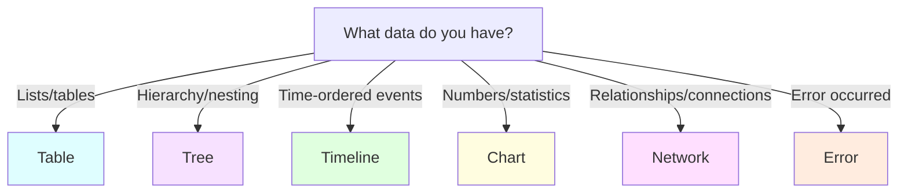

# 📊 Results Guide

Master Sierra Dev's powerful result visualization system.

## 🎯 What Are Results?

Results are structured data formats that make your output:

- **Consistent** - Same format every time
- **Machine-readable** - Easy to parse and process  
- **Beautiful** - Sierra platform renders them with style
- **Flexible** - Multiple formats for different data types

!!! tip "Why not just `print()`?"
    Regular print statements create messy, inconsistent output. Sierra results provide structure, validation, and beautiful rendering!

---

## 📋 Available Result Types

| Type | Best For | Example Use |
|------|----------|-------------|
| **Table** | Tabular data, lists | Port scan results, file listings |
| **Tree** | Hierarchical data | Directory structures, categories |
| **Timeline** | Time-based events | Historical data, logs |
| **Chart** | Statistical data | Distributions, comparisons |
| **Network** | Relationships | Social graphs, network topology |
| **Error** | Error messages | Validation failures, exceptions |

---

## 🗂️ Table Results

Perfect for displaying structured, tabular data.

### Basic Example

```python
import sierra

result = sierra.Table(
    headers=["Name", "Age", "City"],
    rows=[
        ["Alice", "28", "NYC"],
        ["Bob", "35", "LA"],
        ["Charlie", "42", "Chicago"]
    ]
)

sierra.respond(result)
```

**Output (JSON):**
```json
{
  "type": "Table",
  "headers": ["Name", "Age", "City"],
  "rows": [
    ["Alice", "28", "NYC"],
    ["Bob", "35", "LA"],
    ["Charlie", "42", "Chicago"]
  ]
}
```

### Real-World Example: Port Scanner

```python
@invoker.entry_point
def run(target: sierra.Param[str, ...]):
    open_ports = scan_ports(target)  # Your scanning logic
    
    rows = []
    for port in open_ports:
        rows.append([
            str(port.number),
            port.service,
            port.state
        ])
    
    result = sierra.Table(
        headers=["Port", "Service", "State"],
        rows=rows
    )
    
    sierra.respond(result)
```

---

## 🌳 Tree Results

Perfect for heirarchical, nested data.

### Basic Example

```python
result = sierra.Tree(
    tree=[
        "Root",
        {
            "Level 1": [
                "Item A",
                "Item B"
            ],
            "Level 2": [
                "Item C",
                {"Nested": ["Deep item"]}
            ]
        }
    ]
)

sierra.respond(result)
```

### Or Use Helper Function

```python
result = sierra.create_tree_result([
    "Directory: /home/user",
    {
        "documents/": ["report.pdf", "notes.txt"],
        "images/": ["photo1.jpg", "photo2.jpg"]
    }
])

sierra.respond(result)
```

---

## ⏰ Timeline Results

Perfect for time-based events and historical data.

### Example

```python
result = sierra.Timeline(
    events=[
        {
            "timestamp": "2024-01-15T10:30:00Z",
            "title": "Login Attempted",
            "description": "Failed login from IP 192.168.1.1"
        },
        {
            "timestamp": "2024-01-15T10:32:00Z",
            "title": "Lockout Triggered",
            "description": "Account locked after 3 failed attempts"
        },
        {
            "timestamp": "2024-01-15T11:00:00Z",
            "title": "Password Reset",
            "description": "Password reset email sent"
        }
    ]
)

sierra.respond(result)
```

---

## 📈 Chart Results

Perfect for statistical and numerical data visualization.

### Example: Distribution Chart

```python
result = sierra.Chart(
    chart_type="bar",
    labels=["Critical", "High", "Medium", "Low"],
    datasets=[
        {
            "label": "Vulnerabilities",
            "data": [5, 12, 28, 45]
        }
    ]
)

sierra.respond(result)
```

### Supported Chart Types

- `bar` - Bar charts
- `line` - Line graphs
- `pie` - Pie charts
- `radar` - Radar/spider charts

---

## 🕸️ Network Results

Perfect for relationship graphs and network topologies.

### Example: Social Network

```python
result = sierra.Network(
    nodes=[
        {"id": "alice", "label": "Alice"},
        {"id": "bob", "label": "Bob"},
        {"id": "charlie", "label": "Charlie"}
    ],
    edges=[
        {"from": "alice", "to": "bob", "label": "follows"},
        {"from": "bob", "to": "charlie", "label": "follows"},
        {"from": "charlie", "to": "alice", "label": "follows"}
    ]
)

sierra.respond(result)
```

---

## ❌ Error Results

Perfect for reporting errors and validation failures.

### Example

```python
@invoker.entry_point
def run(email: sierra.Param[str, ...]):
    if not email or '@' not in email:
        result = sierra.create_error_result(
            "Invalid email format. Please provide a valid email address."
        )
        sierra.respond(result)
        return
    
    # Continue with valid email...
```

**Output (JSON):**
```json
{
  "type": "Error",
  "error": "Invalid email format. Please provide a valid email address."
}
```

---

## 🎨 Best Practices

### ✅ Do This

```python
# Clear, descriptive headers
result = sierra.Table(
    headers=["IP Address", "Hostname", "Status"],
    rows=data
)

# Handle errors gracefully
if not data:
    sierra.respond(sierra.create_error_result("No results found"))
    return

# Use appropriate types
# Tabular data → Table
# Hierarchical → Tree
# Time-based → Timeline
```

### ❌ Avoid This

```python
# Vague headers
result = sierra.Table(
    headers=["Col1", "Col2", "Col3"],
    rows=data
)

# Mixing result types
# Don't return multiple results!

# Ignoring errors
# Always validate input first
```

---

## 🔄 Choosing the Right Type

Use this decision tree:



---

## 💡 Advanced Tips

### Dynamic Result Selection

```python
@invoker.entry_point
def run(
    format: sierra.Param[
        str,
        sierra.SierraOption(description="Output format: table or tree")
    ] = "table"
):
    data = get_data()
    
    if format == "tree":
        result = convert_to_tree(data)
    else:
        result = convert_to_table(data)
    
    sierra.respond(result)
```

### Combining Data

```python
# Process data first
raw_data = fetch_data()
processed = analyze(raw_data)

# Create comprehensive result
rows = []
for item in processed:
    rows.append([
        item.name,
        item.score,
        item.status
    ])

result = sierra.Table(
    headers=["Name", "Score", "Status"],
    rows=rows
)

sierra.respond(result)
```

---

## 📚 Complete Examples

See these real invokers for inspiration:

- [`tech_detector.py`](https://github.com/xsyncio/sierra-dev/blob/main/example/tech_detector.py) - Table results
- [`subdomain_enumerator.py`](https://github.com/xsyncio/sierra-dev/blob/main/example/subdomain_enumerator.py) - Table with filtering
- [`wayback_analyzer.py`](https://github.com/xsyncio/sierra-dev/blob/main/example/wayback_analyzer.py) - Timeline results
- [`digital_footprint.py`](https://github.com/xsyncio/sierra-dev/blob/main/example/digital_footprint.py) - Network graphs

---

## 🚀 Next Steps

- [Build your first invoker](quickstart.md)
- [Learn advanced techniques](development.md)
- [Explore OSINT tools](osint-tools.md)
