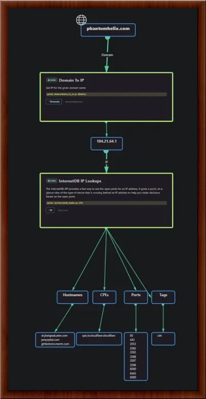
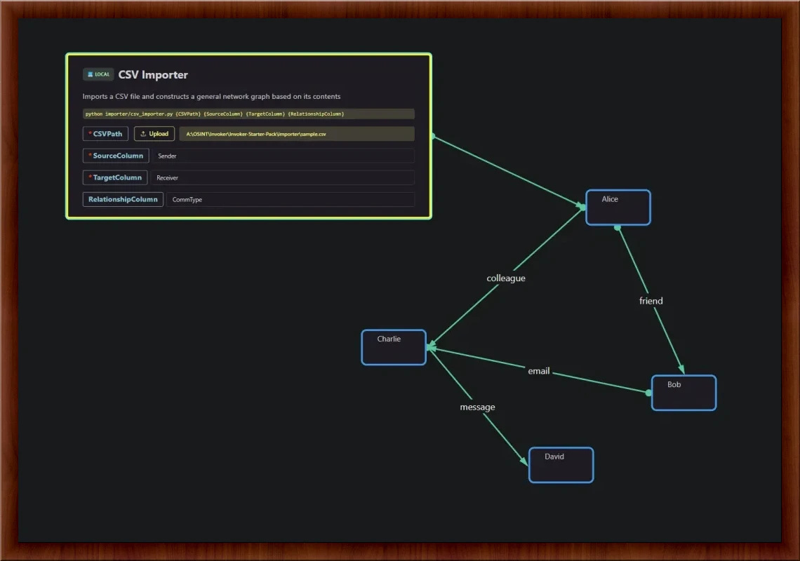

# Result Processing

After your Invoker script runs, SIERRA reads its JSON output and integrates it into the investigation graph according to the `type` field.

---

## Tree Results

```json
{
  "type": "Tree",
  "results": [ … ]
}
```

* **Interpretation**:

  * Each string in `results` becomes a leaf node.
  * Each object maps a parent node to its child array.
* **Effect in UI**:

  * Renders a collapsible hierarchy.
  * Parent nodes can be expanded to reveal children.

---

## Network Results

```json
{
  "type": "Network",
  "origins": [ … ],
  "nodes": [ … ],
  "edges": [ … ]
}
```

* **Interpretation**:

  * `origins` mark starting nodes in the graph.
  * `nodes` defines all entities with unique IDs and content.
  * `edges` defines directed relationships (`source` → `target`) with optional labels.
* **Effect in UI**:

  * Displays an interactive node‑link diagram.
  * You can trace connections from each origin through the network.

---

## Error Results

```json
{ "type": "Error", "message": "…" }
```

* **Interpretation**:

  * Any script error or validation failure.
* **Effect in UI**:

  * Shows a prominent error banner with your `message`.
  * Halts further result rendering for that invocation.

## Internal hanlding of results?

Yes, this kit supports internal dealing of it.

### Tree Type Result

:::sierra.create_tree_result
<figure markdown="span", align="center">
  
  <figcaption>Example of tree type result.</figcaption>
</figure>

### Network Type Result

:::sierra.create_network_result
<figure markdown="span", align="center">
  
  <figcaption>Example of network type result.</figcaption>
</figure>

### Manage Errrors


:::sierra.create_error_result
