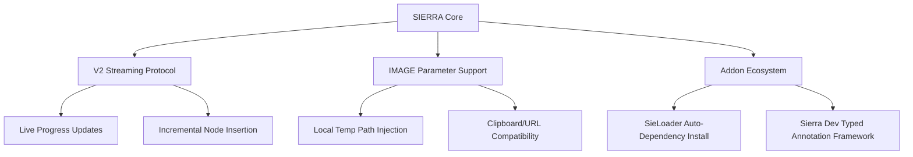

# 🌌 SIERRA Resource Directory & Update Index

Welcome to the central information hub for the **SIERRA Ecosystem**. This folder contains the latest documentation, technical specifications, and workflows gathered from the [Phantom Helix Resources](https://phantomhelix.com/resources) portal. 

These documents outline the next generation of SIERRA's extensibility, showcasing advanced invoker architectures, newly introduced data types, real-time protocols, and the active contributions of the community.

---

## 📂 Navigation & Documents

Explore the components of this update via the dedicated guides below:

```
new/
├── 1_OVERVIEW.md                  <-- You are here
├── 2_INVOKER_SPEC.md              <-- Technical Spec: Invokers, YAML schemas, V1/V2, & IMAGE parameters
└── 3_WORKFLOWS_AND_TUTORIALS.md  <-- Step-by-Step guides, community tools, and cloud invoker catalog
```

### [📄 2_INVOKER_SPEC.md](./2_INVOKER_SPEC.md)
* **What it covers**: The deep technical blueprint for Invoker configurations.
* **Key Features**: 
  * The complete, modern `invoker.yaml` configuration schema.
  * Standard vs. Streaming protocols (**V1 Batch vs. V2 Real-time Streams**).
  * In-depth definition of the **`IMAGE` Parameter Type**, including auto-tempfile mapping and local path injection.
  * Robust stdout and stderr pipeline handling, flushing requirements, and error recovery contracts.

### [📄 3_WORKFLOWS_AND_TUTORIALS.md](./3_WORKFLOWS_AND_TUTORIALS.md)
* **What it covers**: Implementation blueprints, developer workflows, and catalog listings.
* **Key Features**:
  * Step-by-step developer tutorial: **"Your First Domain Expander"**.
  * Complete index of the **Live Cloud Invokers** (Recon, OSINT, Crypto, Images, Profiles).
  * Community frameworks: **SieLoader** package manager, **Sierra Dev** compiler framework, and the **Invoker Starter Pack**.

---

## 🚀 Key Architectural Breakthroughs

The latest updates to the SIERRA engine introduce features that revolutionize how investigators build and run local automation:



### 1. The V2 Streaming Protocol (`Protocol: V2`)
Traditional invokers block execution until completion, rendering results all at once in a batch format (V1). The new V2 protocol parses standard output **line-by-line**, drawing nodes onto the canvas and updating the user's progress bar in real-time. This provides instant visual feedback for long-running scrapers, asset discovery tools, and recursive sub-domain enumerators.

### 2. Native Visual Asset Pipeline (`Type: IMAGE`)
Handling screenshot and image files was previously a manual script responsibility. SIERRA now manages this end-to-end. Scripts declaring an `IMAGE` type argument receive a fully-managed, localized absolute disk pathway. Whether the input is a local image file, a clipboard paste, or a screenshot pulled from a headless browser session, the engine handles the extraction, tempfile caching, and replacement automatically.

---

> [!TIP]
> To integrate these documentation pages directly into your local offline documentation, append the paths of these markdown files under the `Reference` or `Guides` section of your `mkdocs.yml` navigation configuration.
