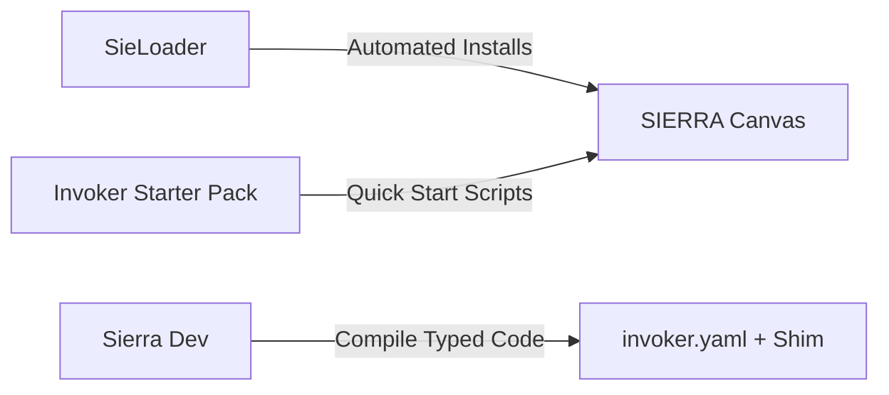

# 🗺️ SIERRA Workflows, Tutorials & Catalog

This document details developer workflows, a beginner tutorial for custom script creation, the community tool integrations, and the complete catalog of live SIERRA Cloud Invokers.

---

## 🎓 1. Step-by-Step Tutorial: "First Domain Expander"

This beginner tutorial walks you through creating a simple local Invoker that extracts subdomains and MX records for any given domain.

### Step 1: Set Up the Invoker Folder
Create a clean directory inside your user folder to store your scripts:
```bash
mkdir -p ~/Documents/sierra-first-invoker
cd ~/Documents/sierra-first-invoker
```

### Step 2: Write the Python Worker (`script.py`)
Create the script that performs the work. This script reads the target domain, executes the checks, and prints the V1 Tree-structured JSON to `stdout`.

```python
# ~/Documents/sierra-first-invoker/script.py
import sys
import json

def lookup_domain(domain: str):
    # 1. Clean parameter inputs
    clean_domain = domain.strip().lower()
    
    if not clean_domain:
        # Standard error return contract
        print(json.dumps({
            "type": "Error",
            "message": "Domain parameter must not be empty."
        }))
        sys.exit(1)
        
    # 2. Perform the domain expansion (Mock OSINT resolution)
    results = [
        f"# Subdomain Resolution for {clean_domain}",
        f"www.{clean_domain}",
        f"api.{clean_domain}",
        f"dev.{clean_domain}",
        
        f"# Mail Server (MX) Records",
        f"mail.protonmail.ch" if "proton" in clean_domain else f"mail.{clean_domain}"
    ]
    
    # 3. Output structural tree representation
    output = {
        "type": "Tree",
        "results": results
    }
    
    print(json.dumps(output))

if __name__ == "__main__":
    # SIERRA executes commands and passes parameters as sys.argv
    if len(sys.argv) < 2:
        print(json.dumps({
            "type": "Error",
            "message": "Missing mandatory target parameter."
        }))
        sys.exit(1)
        
    lookup_domain(sys.argv[1])
```

### Step 3: Configure the Local Mapping (`invoker.yaml`)
Create the configuration file mapping this script to the SIERRA right-click menu for `Domain` nodes.

```yaml
# ~/Documents/sierra-first-invoker/invoker.yaml
name: "First Domain Expander"
description: "Quickly resolve a domain into example pivot nodes."
version: "1.0.0"

# Tell SIERRA to show this tool only when the user right-clicks on a "Domain" node
triggers:
  nodeType: "Domain"

# Define the variables to feed from the canvas into the command
parameters:
  - name: "Domain"
    type: "string"
    value: "$node.value"  # Automatically extract the active node's value

# The shell command to execute
command: "cd ~/Documents/sierra-first-invoker && python script.py \"$Domain\""
```

---

## ☁️ 2. Live Cloud Invokers Catalog

Phantom Helix runs a centralized, high-performance cloud runner that hosts pre-built invokers. Users can call these without installing external dependencies locally.

### 🌐 A. Network, Infrastructure & Domain Intelligence

* **ASN and Country Lookup**: Maps target IP addresses to their corresponding network owner, Autonomous System Number (ASN), and registration country.
* **Chronos**: Crawls target URLs to summarize high-level HTTP response headers, SSL certificate scopes, and historical WayBack Machine snapshot timelines.
* **Cloudflare Radar**: Spawns deep investigation pivots mapping a domain, ASN, or country without requiring custom API tokens.
* **CloudRip**: Maps common domain sub-ranges and identifies hosting infrastructure residing outside standard Cloudflare proxy ranges.
* **Cyber Scraper 2077**: Deep scraper that parses public webpages, extracting linked domains, forms, javascript structures, email records, and phones.
* **DNSDumpster Domain Intel**: Fully maps a domain's DNS footprint, resolving MX, TXT, A, and CNAME records into graph visual nodes.
* **DocuFinderJS**: Crawls a public target domain or web page, extracting linked documents (PDFs, Docx, Xlsx) for forensic scanning.
* **Mantis / reconFTW No-Key Recon**: Initiates lightweight domain reconnaissance and asset discovery pipelines without needing commercial API keys.
* **RoboFinder**: Automatically crawls web servers to parse and extract hidden pathways defined in `robots.txt` configuration files.

### ⛓️ B. Blockchain & Crypto Intelligence

* **Blockchain.com Explorer**: Quickly gathers public Bitcoin (BTC) address metadata, wallet transactions count, and final ledger balances.
* **Blockscan.com**: Spawns explorer links and active pivots across multiple EVM-compatible chains (Ethereum, BSC, Polygon) for wallets and transaction hashes.

### 🖼️ C. Forensics & Visual Assets

* **Image Exif Extractor**: Parses visual assets (PNG, JPG) to read and graph metadata headers (Camera models, software, date modified).
* **Image Geolocation**: Detects embedded GPS coordinates within image metadata, drawing geographical maps on the SIERRA canvas.
* **Image OCR Text**: Automatically processes images to identify, extract, and print text blocks into readable nodes.

### 👤 D. OSINT, Phone & Profile Discovery

* **Phone & Email Lookup**: Cross-references phone strings and emails to detect links to active social media profiles, avatars, and usernames.

---

## 🤝 3. Community Frameworks & Integration Projects

These projects are developed by the community to enhance and extend the SIERRA development and installation experience.



### 1. SieLoader (Package Manager)
* **Author**: `@vladhog`
* **Purpose**: Fully automates addon installations on the canvas. Instead of manually downloading zip files, configuring paths, and mapping shell commands, SieLoader downloads scripts from online indices, parses their dependencies, and registers them inside SIERRA.
* **Repositories**:
  * [SieLoader Core](https://github.com/vladhog/sieloader)
  * [SieLoader Repository Client](https://github.com/vladhog/sieloader-repository-client)

### 2. Sierra Dev (Development Framework)
* **Author**: `@Xsyncio`
* **Purpose**: A comprehensive, typed, annotation-based Python framework for building and compiling SIERRA invokers. Eliminates manually writing configuration YAML by compiling typed Python classes directly into working standalone configurations.
* **GitHub Repository**: [Sierra Dev Repository](https://github.com/xsyncio/sierra-dev)
* **Documentation Portal**: [Sierra Dev Docs](https://xsyncio.github.io/sierra-dev)

### 3. Invoker Starter Pack
* **Author**: `@Runtime Terror`
* **Purpose**: A collection of fully functional scripts pre-configured for instant use in common OSINT and web reconnaissance activities.
* **GitHub Repository**: [Invoker Starter Pack](https://github.com/eastrd/invoker-Starter-Pack)
